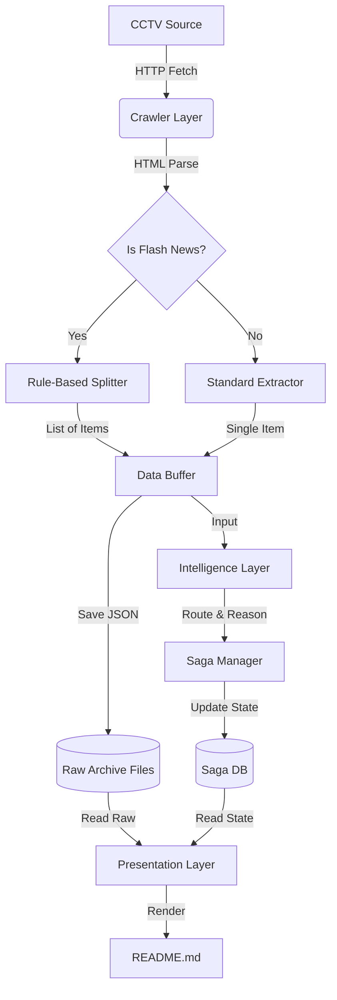

# 🚀 News Saga Engine v2.0 - 架构升级设计文档

## 1. 项目愿景与升级目标

本项目将从单一的“重点新闻追踪器”升级为**“全量新闻档案馆 + 智能叙事引擎”**。

* **全量留存 (Full Archive)**：无论是否重要，每日爬取的所有原始新闻（含拆分后的快讯）必须永久留档保存为 JSON。
* **快讯拆解 (Flash Mining)**：针对“国内/国际联播快讯”，利用 HTML 结构特征进行**零 Token 成本**的规则拆分，将一条长新闻拆解为 5-10 条独立事件，提升分析颗粒度。
* **透明展示 (Visual Audit)**：在 GitHub 报告中不仅展示 AI 分析的故事线，还要折叠展示当天的全量原始数据供人工查阅。

---

## 2. 系统架构设计 (Architecture)

采用 **"提取-转换-加载-分析 (ETLA)"** 管道架构：



### 核心层级说明：

1. **采集层 (Ingestion)**: `CrawlerService`。负责下载、HTML 解析。**新增**：针对特定 URL 或标题的 HTML 结构拆解逻辑。
2. **档案层 (Archive)**: `Archiver` (新增)。负责将清洗后的“扁平化”新闻列表保存为 `data/raw/{year}/{date}.json`。
3. **认知层 (Cognitive)**: `Intelligence`。保持不变，但输入的数据将变得更加纯净、颗粒度更细（快讯已被拆开）。
4. **展示层 (Presentation)**: `Reporter`。负责生成包含“智能分析”和“原始档案”的双层 Markdown 报告。

---

## 3. 详细模块职责与数据流

### A. 爬虫与拆分 (src/crawler.py)

* **职责**：下载网页，提取正文。
* **关键改进**：
* `fetch_daily_briefing`：在返回结果前，必须对列表进行“扁平化”处理。
* **新增私有方法 `_parse_flash_news(html)**`：
* **输入**：快讯详情页的 HTML 源码。
* **逻辑**：使用 `BeautifulSoup` 查找正文区。
* **规则**：遍历所有 `<p>` 标签。如果 `<p>` 内部包含 `<strong>` 或 `<b>` (加粗文本)，则视为**子标题**；紧随其后的 `<p>` 视为**子内容**。
* **输出**：返回一个 `List[RawNewsItem]`，每一条都包含独立的标题和内容，URL 可加上锚点后缀（如 `#1`, `#2`）。


### B. 档案管理 (src/archiver.py) - **[NEW]**

* **职责**：负责数据的落地存储，与业务逻辑解耦。
* **方法**：
* `save_daily_raw(data: DailyBriefing)`：将当天的全量数据保存到 `data/raw/YYYY/MM/DD.json`。
* `load_daily_raw(date_str)`：读取历史档案（用于回溯分析或重新生成报告）。


### C. 报告生成 (src/reporter.py)

* **职责**：渲染 Markdown。
* **改进**：
* **Section 1**: 渲染 Saga Cards (保持现状，按更新时间排序)。
* **Section 2**: 渲染 **"🗄️ 今日全量档案 (Daily Archive)"**。
* 使用 HTML `<details><summary>点击查看今日 {N} 条原始新闻</summary>...</details>` 折叠。
* 内部表格列出：`[类型(快讯/普通)]`, `[标题]`, `[链接]`, `[AI 判定结果(Create/Append/Ignore)]`。


---

## 4. 改进方案与实施计划 (Step-by-Step)

请按照以下步骤指导 AI 进行代码编写。

### 📅 Phase 1: 爬虫层的“手术” (The Splitter)

**目标**：让爬虫能够识别快讯并自动拆分，不再返回一大坨文本。

* **Prompt 指令**：
> "修改 `src/crawler.py`。引入 `BeautifulSoup`。在 `_fetch_full_content` 中增加逻辑：当新闻标题包含 '联播快讯' 时，调用新方法 `_extract_flash_sub_items`。该方法应遍历 HTML 的 `<p>` 标签，提取 `<strong>` 内容作为子标题，提取后续文本作为子内容，将一条快讯拆解为多个 `RawNewsItem` 返回。保持原有的 Pydantic 结构不变。"


### 📅 Phase 2: 建立档案系统 (The Archive)

**目标**：确保所有爬下来的数据（包括拆分后的）第一时间存盘。

* **Prompt 指令**：
> "新建 `src/archiver.py`。实现 `DataArchiver` 类。功能：接收 `DailyBriefing` 对象，将其序列化为 JSON，保存路径为 `data/archive/{year}/{date}_raw.json`。确保目录自动创建。然后在 `main.py` 中调用它，在爬虫获取数据后立即保存。"


### 📅 Phase 3: 渲染层升级 (The Face)

**目标**：在 README 中展示全量数据。

* **Prompt 指令**：
> "修改 `src/reporter.py`。在 `generate_readme` 方法中增加一个部分 '## 🗄️ 今日原始档案'。读取当天的 `DailyBriefing` 数据（或从 Archiver 读取），使用 Markdown 的 `<details>` 标签折叠展示一个表格，列出当天所有新闻的标题和链接，方便人工审计。"


### 📅 Phase 4: 集成测试

**目标**：验证快讯是否被成功拆分，且 Token 消耗是否合理。

* **验证点**：
1. 运行爬虫，查看 `data/archive` 下生成的 JSON。
2. 检查 JSON 中，“联播快讯”是否消失了，取而代之的是 5-10 条具体的短新闻。
3. 观察控制台日志，确认 `Intelligence` 模块正在逐个分析这些短新闻（你会看到很多 "Create" 或 "Ignore"）。


---

## 5. 关键数据结构定义 (Schema Update)

无需大幅修改，只需微调 `RawNewsItem` 以支持来源追踪。

```python
# src/schema.py (建议修改)

class NewsType(str, Enum):
    NORMAL = "normal"
    FLASH_SUB = "flash_sub" # 标识这是从快讯里拆出来的

class RawNewsItem(BaseModel):
    title: str
    url: str
    content: str
    date: str
    type: NewsType = NewsType.NORMAL # 新增字段
    parent_url: Optional[str] = None # 如果是子新闻，记录父链接

```